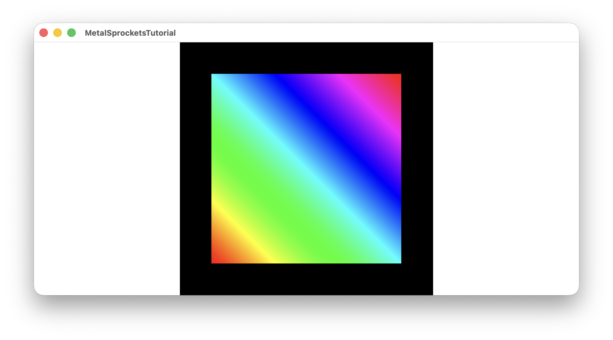

# Tutorial 3 - Animated Rainbow Quad

This tutorial extends Tutorial 2 by adding animation to the rainbow gradient using the RenderView context's time parameter.

## Key Concepts

- Using `context.frameUniforms.time` from RenderView to animate shaders
- Passing uniform parameters to shaders using `.parameter()` on `Draw` elements
- Matching parameter names between Swift and Metal for automatic binding

## Changes from Tutorial 2

1. **ContentView.swift**: Pass `context.frameUniforms.time` to the render pipeline
2. **RainbowQuadRenderPipeline.swift**: Accept time parameter and use `.parameter("time", value: time)` on the `Draw` element
3. **Shaders.metal**: Add a `time` parameter to the fragment shader and use it to animate the hue offset

