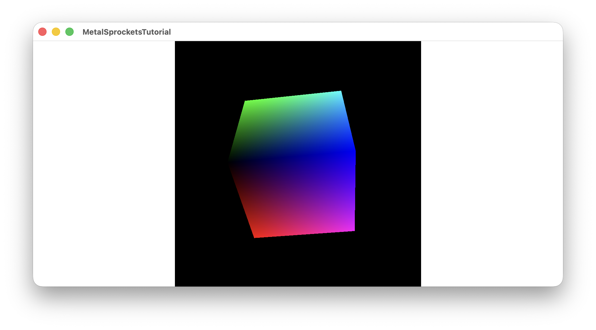

# Tutorial 4: 3D Spinning Cube

This tutorial introduces 3D rendering with Metal, featuring:
- **Model Matrix**: Rotation transform for the spinning animation
- **View Matrix**: Camera positioning (simulating "looking at" the scene)
- **Projection Matrix**: Perspective projection for 3D depth
- **Depth Testing**: Ensures correct front-to-back rendering

## Key Concepts

### The MVP Matrix Pipeline
3D graphics use three transformation matrices applied in order:

1. **Model Matrix** - Transforms object from local space to world space (rotation, position, scale)
2. **View Matrix** - Transforms world space to camera/eye space (camera position and orientation)
3. **Projection Matrix** - Transforms to clip space with perspective (near objects appear larger)

### Depth Testing
Without depth testing, triangles render in draw order - back faces can appear over front faces. Enabling depth testing with `.metalDepthStencilPixelFormat(.depth32Float)` and `.depthCompare(function: .less, enabled: true)` ensures correct occlusion.

### Vertex Colors
Each cube vertex is colored based on its 3D position:
- X position → Red channel
- Y position → Green channel  
- Z position → Blue channel

This creates a smooth color gradient across the cube's surface.

## Files

- **ContentView.swift** - Sets up the MVP matrices each frame
- **SpinningCubeRenderPipeline.swift** - Passes uniforms to shaders, enables depth testing
- **Shaders.metal** - Transforms vertices through MVP, passes colors to fragment shader
- **Vertex.swift** - 3D vertex struct with position and color
- **MatrixHelpers.swift** - Matrix creation utilities (translation, perspective, rotation)

## Screenshot

